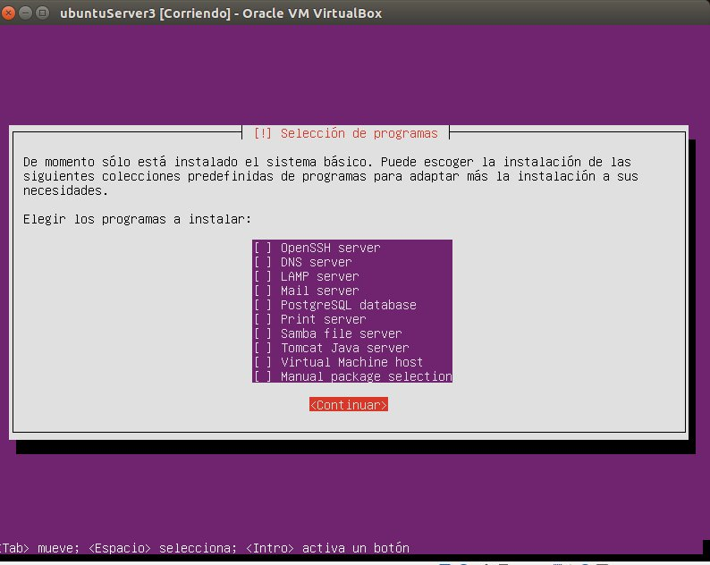

# Práctica 3

## Objetivo

En esta práctica el objetivo es configurar las máquinas virtuales de forma que dos  hagan de servidores web finales mientras que la tercera haga de balanceador de carga por software.

## Tareas a realizar

1. Configurar una nueva máquina virtual sin Apache.
2. Configurar una máquina e instalarle el nginx como balanceador de carga.
3. Configurar una máquina e instalarle el haproxy como balanceador de carga.

## Resultados
#### 1. Configurar una nueva máquina virtual sin Apache




#### 2. Configurar una máquina e instalarle el nginx como balanceador de carga 
===============
#### Instalación de Niginx 
- Importar la clave del repositorio software
```sh
$ cd /tmp/
$ wget http://nginx.org/keys/nginx_signing.key
$ apt-key add /tmp/nginx_signing.key
$ rm -f /tmp/nginx_signing.key
```


- Añadir el repositorio al fichero /etc/apt/source.list


- Instalar el paquete Nginx.

```sh
$ apt-get update
$ apt-get install nginx
```
- Configurar Niginx
   
   > editar el fichero de configuración de nginx por defecto 

     ```sh
	vim /etc/nginx/conf.d/default.conf
     ```
  - Definir que máquinas forman parte del cluster web.
  - indicar a nginx que use ese grupo a las cuales debe repartir el tráfico.

*Contenido del fichero*


   
- Una vez configurado lanzar el servicio nginx.
```sh
$ service nginx restart
```
*La orden anterior en mi caso no funciona, para lanzar el servicio lo realizo con la siguiente orden.*

```sh
$ /etc/init.d/nginx restart
```


- Comprobar el funcionamiento. 


#### 3. Configurar una máquina e instalarle el haproxy como balanceador de carga. 

- Instalar haproxy.
```sh
$ apt-get install haproxy
```
- Modificar el archivo /etc/haproxy/haproxy.cfg


- Comprobar el funcionamiento del balanceador.
```sh
$ /usr/bin/haproxy -f /etc/haproxy/haproxy.cfg
```


